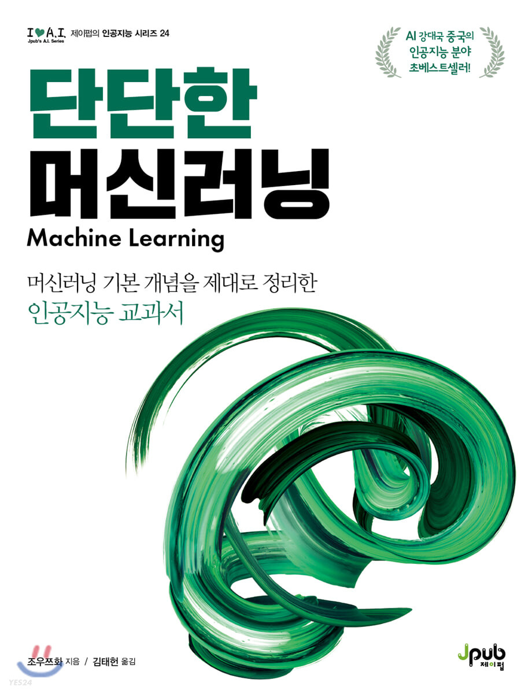

# machine-learning-zhou_zhihua

> <단단한 머신러닝>(조우쯔화) 스터디 저장소

## 📘 GitBook

[**link**](https://bangvkf3.gitbook.io/machine-learning-zhou%5C_zhihua)

## 👥 Contributors

| [bangvkf3](https://github.com/bangvkf3) | [gusrn0505](https://github.com/gusrn0505) | [Thomas Lee](https://github.com/tomtom1103) |
| --------------------------------------- | ----------------------------------------- | ------------------------------------------- |

## 🎯 발표 자료

| Chapters                  | 일정                         | 발표자 |
| ------------------------- | ---------------------------- | ------ |
| 2. 모델 평가 및 선택      | 1회차(2021.01.10~2021.01.17) | 방준혁 |
| 3. 선형 모델              | 1회차(2021.01.10~2021.01.17) | 황세현 |
| 4. 의사결정 트리          |                              |        |
| 5. 신경망                 |                              |        |
| 6. 서포트 벡터 머신       |                              |        |
| 7. 베이지안 분류기        |                              |        |
| 8. 앙상블 학습            |                              |        |
| 9. 클러스터링             |                              |        |
| 10. 차원 축소와 척도 학습 |                              |        |
| 11. 특성 선택과 희소 학습 |                              |        |
| 12. 계산 학습 이론        |                              |        |
| 13. 준지도 학습           |                              |        |
| 14. 확률 그래피컬 모델    |                              |        |
| 15. 규칙 학습             |                              |        |
| 16. 강화 학습             |                              |        |

## 📜 Ground Rule

[**link**](https://github.com/bangvkf3/machine-learning-zhou_zhihua/wiki/Ground-Rule)

## 📖 Text

  
    <a href="http://www.yes24.com/Product/Goods/88440860">
       단단한 머신러닝     
    </a>

